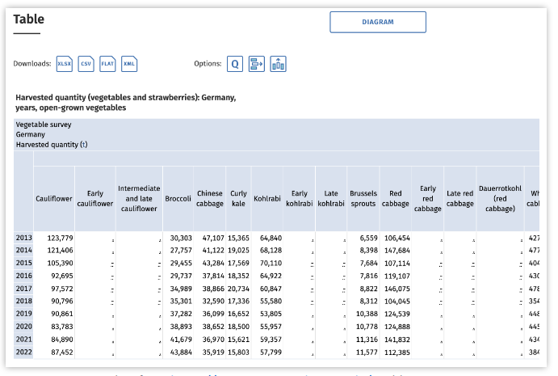

# Project 1

In your first course project you will do an exploratory data analysis (EDA) on a dataset provided by the **Statistisches Bundesamt** (destatis, the national statistics office of Germany).

## Assignment Week 1

Exploratory data analysis means to analyze data sets by summarizing their main characteristics using descriptive statistics and visual methods. 
Formal modeling and hypothesis testing can be done, too, but does not have to be part of an EDA. Destatis has large amounts of data on a variety of topics, and typically in good quality, so it is a good source to work with.

This first project assignment is about selecting a dataset that you want to work with: 
Go to the destatis Genesis online [portal](https://www-genesis.destatis.de/genesis/online/data?operation=sprachwechsel&language=en) or [the german language version](https://www-genesis.destatis.de/genesis/online) and browse through the topics and tables to find a dataset that you find interesting. 
It can be related to your study subject, but it does not have to be. Make sure that the dataset that you choose is not too small (there are some few tables which only contain a handful of data rows, that simply does not give a lot of possibilities for interesting analyses).

The “START the value retrieval” button under „Table retrieval” is very useful for a quick impression of datasets. Note that you can configure the table structure before starting the retrieval, for example swapping rows and columns. Also, you can configure the range of years (default is often 10) and other atributes to be included. Keep this in mind for later, as depending on the kind of analyses you want your program to perform, a particular structure of the table might be more convenient. With or without customization, we will finally have to download the dataset in program-accessible form, i.e., ideally in CSV (comma-separated values) format. 

CSV files can be opened by spreadsheet programs like MS Excel or OpenOffice Calc, but are especially convenient for processing through own code.

When you have chosen a dataset, write a bit of text (not more than one page in A4 format) where you briefly state why you find this data interesting, describe the dataset in your own words, and brainstorm about questions that you would like to get answered with the data. Just note these points down in plain text format somewhere for the moment, we will discuss project structure and where to put such things next week. Also, don’t worry about how to implement all that with Python at this moment, we will also come to that later.

_For example, I might have chosen the table „[Harvested quantity (vegetables and strawberries)](https://www-genesis.destatis.de/genesis/online?operation=table&code=41215-0001&bypass=true&levelindex=1&levelid=1682331849908#abreadcrumb): [Germany, years, open-grown vegetables](https://www-genesis.destatis.de/genesis/online?operation=table&code=41215-0001&bypass=true&levelindex=1&levelid=1682331849908#abreadcrumb)“ (code [41215-0001](https://www-genesis.destatis.de/genesis/online?operation=table&code=41215-0001&bypass=true&levelindex=1&levelid=1682331849908#abreadcrumb)) from the “Vegetable survey”. I find this dataset interesting because I like eatinng vegetables and I prefer to buy regional produce. The dataset contains data about the harvested quantities (in tons) of various kinds of vegetables grown in the open. Data are reported per year. Possible questions to answer with these data:_

`How has annual harvest for particular vegetables developed (increased/decreased) in the past decade?` 

`What are currently the most-grown vegetables in Germany?` 

`For which vegetables have the harvested quantities declined most?`

`How did vegetable produc:on in Germany change aUer 1989?`

**Remember that for this first project, everyone is expected to work on a topic individually. Do not hesitate to discuss about your chosen dataset with your fellow course mates, though. It is not a secret, and a bit of exchange often helps to get fresh ideas**.

## Assignment Week 2

Last week you have selected a dataset and brainstormed about possible research questions than can be answered with the data. This week you will take this a step closer to implementation, however still without writing any code: The assignment is to take your research questions as a starting point and identify suitable methods to address them. 

For example, the question “How has annual harvest for particular vegetables developed (increased/decreased) in the past decade” could be answered with a line plot that has the years on the x-axis, the harvested amount in tons on the y-axis and differently colored lines for a selection of vegetables included in the vegetable survey dataset. Also check if there is a (Python) package that already provides the functionality needed (e.g. the plot() function in the pandas package) or if you would need to program a function for it yourself. 

Note your findings (methods and possible packages/functions to use) in the document where you also captured your research questions. 
We will come back to this next week. 

## Assignment Week 3

This week's project assignment has two parts: Getting your project set up for Git.UP, and creating the Jupyter notebook for your computational narrative. 

### 3.1 Git.UP Setup

To complete and submit the project you will need to use Git.UP, [https://gitup.uni-potsdam.de/](https://gitup.uni-potsdam.de/). To get set up for that do the following:

1. Give your project a name that you can use for your local working
directory, your Git.UP repository etc. Be aware that changing such a name later is
possible, but not exactly easy, so try to find something sensible.

2. Using that name, create a blank project repository on Git.UP. Set the “Visibility Level” to
“private”, and do not let Git.UP initialize the repository with a README. Invite Akshay Devkate or Nikolas Bertrand (GitLab username devkate, nbertrand) as a member with role “Reporter”, so that they can see your project, give feedback, and eventually access the project for grading.

3. On your computer, create a (local) project directory (it is recommended to use the same name as on Git.UP). To begin with, add the following content:
- A `.gitignore` file that contains `__pycache__`
- A `data/` directory where you put your chosen dataset in .csv format.
- A `docs/` directory where you add a simple text file `description.txt` where you add the description of your dataset and research questions that you wrote for last week’s assignment.

4. Make your local project directory a Git repository (`git init`), then connect it to your remote project repository on Git.UP (`git remote add origin`). `Add`, `commit` and `push` your project files to the staging area, local repository and remote repository, respectively.

### 3.2 Computational Narrative

Develop a computational narrative for your project and implement it in a Jupyter notebook. Alternate MarkDown and Code cells, letting the former contain the narrative around your data analysis, and the former the pieces of code that you need for illustrating the narrative. 

Make sure to meet the following requirements: 
1. The computational narrative is presented in **one** Jupyter Notebook. 
2. Longer pieces of code, especially when not directly meaningful for the narrative (for example details of the data pre-processing when loading the data from the CSV files), are stored in separate .py modules and imported to the notebook. 
3. The notebook has different sections, including introductory text with a description of the data set, data loading, the different analyses with explanations, a summary/conclusion, and possible references. 
4. Store the notebook in a `bin/` or  `src/` directory within your project.

<!--Feel free to be creative and add additional features. For example, integrate additional datasets in the analysis, have a look into geovisualization or make analyses interactive. Of course, you can easily challenge yourself more in this project by trying more sophisticated analyses. The Python ecosystem is full of interesting data science libraries, browse the web for inspiration.--> 

Some important remarks about this assignment: 

- More likely than not, you will discover that the dataset that you downloaded originally is not completely fit to purpose, e.g., not suitably formatted or including information that you do not need. Recall that the destatis/Genesis portal provides some configuration options before downloading the data, this might help with some issues. Still, some manual data cleaning might be needed to bring you dataset in good shape for your analyses. You can do that in a spreadsheet program like MS Excel, but it is strongly recommended to save the resulting table in CSV format for further processing. 

- Keep in mind what we discussed about coding style, and try to write readable code from the start. Feel free to make use of a linter and the checklist from the exercises, generally refactor your code when you spot something that could be done better.

- Finally, do not forget to commit your work to your Git.UP repository regularly, so that you build up a version history and have your work in a safe place. 

## Assignment Week 4

This is the last weekly assignment for the work on the individual project. It is about checking/revising the project structure, adding relevant metadata, and submitting the final version for grading.

### 4.1 Project structure

We had already instructed you in the last weeks to put your project data in a `data/`directory, and the Python code and Jupyter Notebooks in `scr/` or `bin/`. In the last lecture we now also discussed the "good enough" reference project structure that is a good baseline for small to medium-size data science projects. Check if your project structure already matches this reference, and revise if necessary. 

### 4.2 Metadata files

Add the following metadata file to your project: 
- A README.md that provides a brief overview of the project, a usage guide and contact information. It should also link to the license information and citation file (see next two points).
- Choose a license for your project and add a corresponding license file. Mention the type of license in the README.md and provide a link to the full license text there. 
- Add a CFF file containing software citation information for your project. Also add a link to it form the READMEmd file.

As this is a fairly small, individual project, adding additional metadata like contribution guidelines and a code of conduct is not expected here. We will do that for the larger group project. 

### 4.3 Finalize and submit

Revisit again all the project instructions above and check that you have implemented your project according to requirements. If anything remains unclear, approach the tutors in the lab or by email to clarify.

When you are done, create a release as submission **by Sunday, 12.05.2024, 23:59**:
1. On Git.UP, go to your project page.
2. In the left sidebar, select “Deployments > Releases” and select “New release”.
3. On the page that opens, enter “v1.0” as tag name and “submission” as release title. The other fields can be left as they are.
4. Click “Create release” at the bottom of the page.
5. Done.  (Akshay or Niko are reporter on your project and can see and access this release, so there is no need to submit your project anywhere else.

